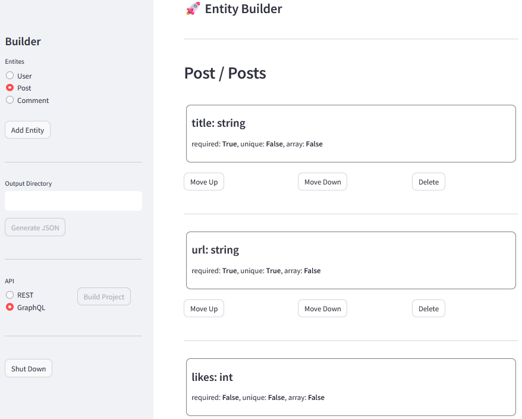

# API Builder
Dynamically generate REST and GraphQL API code from user-defined entities using a [Streamlit](https://www.streamlit.io/)-based interface.

## Overview
API Builder employs a blueprint-based approach to code generation, streamlining the process of 
expanding and maintaining the functionality of the app.

### Features
- [x] **Simple Interface**: Define the entities, specifying their fields and relationships, using a simple UI.
- [x] **Dynamic Code Generation**: Generate API code using the entity data, without writing a single line of code.
- [x] **Blueprint Model**: Easily incorporate new features and expand the functionality of the base blueprints.

## Getting Started
1. Install Dependencies: Run `pip install -r requirements.txt` to install the necessary packages.
2. Start the Application: Execute `api-builder.bat` to launch the Streamlit UI.
3. Define Entities and Fields: Use the UI to specify the entities and fields for your API.
4. Generate Project: Click the "Build Project" button to generate the API code.

## How It Works
- The UI generates a JSON file with the entity data, which is then used by project builder part of the application.
- All of the information on how to generate each specific file of the API is contained within the file itself (blueprints).
- The project builder uses the entity data and this blueprint model to generate the API code, preserving the 
directory structure and file names from the model.